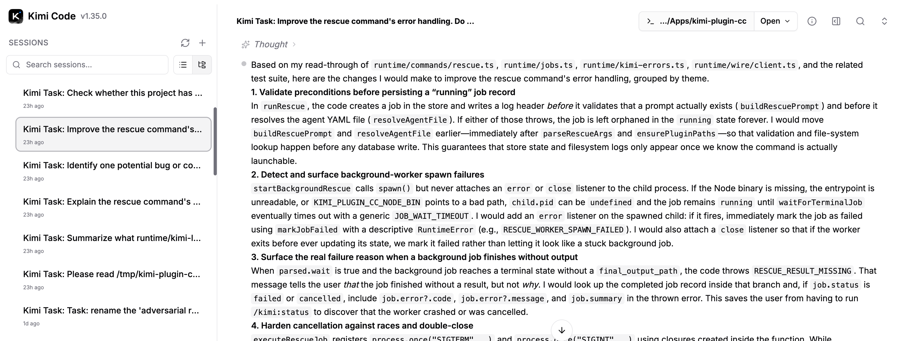

# kimi-plugin-cc

Use [Kimi](https://kimi.ai) as Claude Code's second reviewer, independent thinker, and delegated worker — without building your own multi-agent stack.

This is a [Claude Code](https://claude.ai/code) plugin that connects to [Kimi CLI](https://github.com/MoonshotAI/kimi-cli)'s **Wire mode** — an experimental streaming protocol that gives full programmatic access to a Kimi agent session. Claude can ask Kimi for a structured code review, delegate a bug hunt, or have Kimi double-check its own work before stopping — all through slash commands, with persistent job state and session resume.

- **Independent model, independent perspective.** Kimi reasons differently from Claude. A second opinion from a different model catches things self-review misses.
- **No orchestration layer required.** No ACP, no cloud broker, no shared API keys. The plugin talks directly to a locally-installed `kimi` CLI over stdio.
- **Full agent capabilities.** Kimi can read files, write code, run shell commands, and resume where it left off — all bounded by a [companion-side approval allowlist](./runtime/rescue-approval.ts) that the plugin enforces.

## Try it in 60 seconds

```
/plugin marketplace add linxule/kimi-plugin-cc
/plugin install kimi@kimi-marketplace
/kimi:setup
/kimi:review "review my current diff"
```

Kimi reads your working-tree diff and returns structured findings:

```json
{
  "summary": "One high-confidence issue in the auth middleware.",
  "verdict": "concern",
  "findings": [
    {
      "severity": "high",
      "confidence": "high",
      "title": "JWT expiry not checked before token refresh",
      "file": "src/middleware/auth.ts",
      "start_line": 42,
      "end_line": 47,
      "body": "The refresh handler calls getNewToken() without first checking whether the current token has actually expired...",
      "suggested_fix": "Add an expiry check before the refresh call."
    }
  ]
}
```

Claude reads these findings and can act on them directly. To go further:

```
/kimi:rescue "fix the top review finding"
```

Kimi opens the file, writes the fix, runs the relevant tests, and reports back. The session persists — if you restart Claude Code, `/kimi:rescue --resume` picks up where it left off.

## When to use what

| Command | What it does | Kimi can write? | Session persists? |
|---------|-------------|-----------------|-------------------|
| `/kimi:ask` | Free-form Q&A — "explain this module"; supports `--background` / `--wait` like rescue | No | Fresh by default, `-r` to resume |
| `/kimi:review` | Structured code review of your diff | No | Fresh each time |
| `/kimi:challenge` | Adversarial review with a custom focus | No | Fresh each time |
| `/kimi:rescue` | Delegate real work — bug hunts, refactors, fixes | Yes (allowlisted) | Persists + resumable |
| Review gate | Kimi checks Claude's work before stopping | No | Per-stop-event |

The plugin ships four Claude Code **subagents** that the main thread can dispatch proactively via the Agent tool: `kimi-rescue` (write-capable delegation), plus `kimi-review`, `kimi-challenge`, and `kimi-ask` (read-only forwarders to the matching companion surfaces). Each agent's description is Kimi's own statement of what it's good for — Claude matches the moment and dispatches; no prescriptive skill manual in between.

## How it works

The architecture is modeled after OpenAI's [codex-plugin-cc](https://github.com/openai/codex-plugin-cc). Both follow the same pattern: thin plugin shell, rich local runtime, one process per job.

```
  /kimi:review "check the auth flow"
       │
       └─ companion.sh → node dist/companion.js
               │
               ├─ spawns: kimi --wire --session <uuid> --agent-file review.yaml
               ├─ streams JSON-RPC events over stdio (Wire protocol)
               ├─ turn capture: buffers ContentParts after last ToolResult
               ├─ approval dispatcher: auto-approves reads, allowlists writes
               ├─ persists job + event log to SQLite (node:sqlite, zero native deps)
               └─ returns structured result to Claude
```

**Wire-first transport.** The plugin implements a full [Wire client](./runtime/wire/) in TypeScript — JSON-RPC over stdio with `start`, `initialize`, `prompt`, approval dispatch, turn capture, and `close`-based exit semantics. Each command mode runs a custom Kimi [agent profile](./runtime/agents/) (`--agent-file`) that controls which tools Kimi has access to. This is one of the first third-party consumers of Kimi CLI's Wire protocol.

**Job lifecycle.** Every job gets a client-assigned UUID, a SQLite record (created before the Wire connection opens), and a full event log. Jobs go through `running` → `completed`/`failed`/`cancelled`. Use `/kimi:status`, `/kimi:result`, `/kimi:cancel`, `/kimi:replay` to manage them.

**Rescue approval policy.** When Kimi has write access (rescue mode), every file edit and shell command goes through the [approval allowlist](./runtime/rescue-approval.ts): symlink-aware path containment, `.git/` exclusion, a curated set of read-only check tools, and explicit rejection of `package-manager run <script>` (opaque scripts are a supply-chain risk). The allowlist is the security boundary — not the system prompt.

**Zero native dependencies.** The runtime uses Node 22.5's built-in `node:sqlite` — no `better-sqlite3`, no `node-gyp`, no compilation step. `dist/` is precompiled and committed, so installed plugins work immediately with just `node` on PATH.

**132 tests, drift gate.** The test suite covers the Wire client, approval allowlist, command handlers, job lifecycle, session-title integration, and more. `bun run check` rebuilds `dist/` and fails if the rebuild produces uncommitted changes — forgotten rebuilds can't ship.

## kimi web integration

Every plugin session appears in [kimi web](https://github.com/MoonshotAI/kimi-cli) with a human-readable title. The plugin calls `PATCH /api/sessions/{id}` on the local kimi web server after session creation, setting titles like `Kimi Task: review my current diff` (read-only) or `Kimi Task: fix the auth bug [write]` (rescue).

This means you get a unified view of all Kimi work — terminal sessions and plugin-delegated sessions side by side, searchable by the `Kimi Task` prefix.

<p align="center">
  
  <br />
  <em>Plugin-created sessions in kimi web — each titled with the task prompt, browsable alongside regular terminal sessions.</em>
</p>

> **Note for Kimi CLI maintainers:** The plugin would benefit from a native `--session-title TEXT` flag on `kimi --wire` so titles can be set in-band during session creation, eliminating the PATCH workaround. See the [session-title runtime](./runtime/session-title.ts) and [kimi-web client](./runtime/kimi-web-client.ts) for the current integration.

## Install

### Via the Claude Code marketplace (recommended)

```
/plugin marketplace add linxule/kimi-plugin-cc
/plugin install kimi@kimi-marketplace
/kimi:setup
```

### From a local clone

```bash
git clone https://github.com/linxule/kimi-plugin-cc ~/kimi-plugin-cc
claude --plugin-dir ~/kimi-plugin-cc
```

Then run `/kimi:setup` to verify the local `kimi` CLI is reachable and authenticated.

## Prerequisites

- **Kimi CLI** on `PATH` — requires `--wire`, `--session`, and `--agent-file` support (recent versions). Set `KIMI_PLUGIN_CC_KIMI_BIN` to override.
- **Node >= 22.5** — for built-in `node:sqlite`. Set `KIMI_PLUGIN_CC_NODE_BIN` to override.
- **bun** — only for contributor tooling. Not required at runtime.

## Development

```bash
bun run check    # rebuild dist/, typecheck, run 132 tests, drift gate
bun test <path>  # run a single test file
```

See [CONTRIBUTING.md](./CONTRIBUTING.md) for the full contributor workflow.

## How this was built

This plugin was built through the same multi-model collaboration it enables — Claude, Kimi, and Codex working together at every stage from design through pre-public audit.

## Acknowledgments

- **[Kimi](https://kimi.ai)** (Moonshot AI) — the reasoning model this plugin delegates to, and a design/review collaborator throughout development
- **[Codex](https://openai.com/index/codex/)** (OpenAI) — architecture consults, parallel implementation, and independent pre-ship reviews via the [codex-plugin-cc](https://github.com/openai/codex-plugin-cc) companion plugin
- **[Claude Code](https://claude.ai/code)** (Anthropic) — the host environment, primary development agent, and the platform this plugin extends

## License

[Apache-2.0](./LICENSE)
